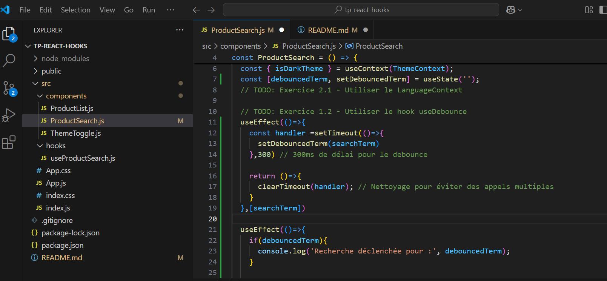

# TP React Hooks - Application de Gestion de Produits

Ce TP a pour objectif de mettre en pratique l'utilisation des Hooks React (useState, useEffect, useContext) ainsi que la création de Hooks personnalisés.

## Installation et configuration initiale

1. Cloner le dépôt :
```bash
git clone https://github.com/pr-daaif/tp-react-hooks.git
cd tp-react-hooks
```

2. Créer votre propre dépôt sur Github et changer le remote :
```bash
# Supprimer le remote origine
git remote remove origin

# Ajouter votre nouveau remote
git remote add origin https://github.com/[votre-username]/tp-react-hooks.git

# Premier push
git push -u origin main
```

3. Installer les dépendances :
```bash
npm install
```

4. Lancer l'application :
```bash
npm start
```

## Instructions pour le TP

Pour chaque exercice :
1. Lisez attentivement l'énoncé
2. Implémentez la solution
3. Testez votre implémentation (pensez à faire des copies d'écran)
4. Mettez à jour la section correspondante dans ce README avec :
   - Une brève explication de votre solution
   - Des captures d'écran montrant le fonctionnement
   - Les difficultés rencontrées et comment vous les avez résolues
5. Commitez vos changements avec un message descriptif

### Exercice 1 : État et Effets 
#### Objectif : Implémenter une recherche en temps réel

- [ ] 1.1 Modifier le composant ProductSearch pour utiliser la recherche
- [ ] 1.2 Implémenter le debounce sur la recherche
- [ ] 1.3 Documenter votre solution ici

_Votre réponse pour l'exercice 1 :_

Explication de ma solution
En modifiant ProductSearch, j'ai utiliser un debounce pour permettre la recherche en temps réel.
pour le debounce, j'ai utiliser :

   1- la fonction setTimeout de 300 ms pour mettre à jour la variable debouncedTerm lorsqu'un     utilisateur saisie dans le champs de recherche.  

   2- la fonction clearTimeout pour annuler la mise à jour de la variable debouncedTerm, lorsque l'utilisateur saisie à nouveau  avant la fin des 300 ms.

dans mon code, le premier hooks useEffect intégrant les fonctions setTimeout et clearTimeout gère le délai et l'annulation pour chaque mise à jour de searchTerm. Le second attend la nouvelle valeur de debouncedTerm et déclenche la recherche.





### Exercice 2 : Context et Internationalisation
#### Objectif : Gérer les préférences de langue

- [ ] 2.1 Créer le LanguageContext
- [ ] 2.2 Ajouter le sélecteur de langue
- [ ] 2.3 Documenter votre solution ici

_Votre réponse pour l'exercice 2 :_
```
Nous avons créé le LanguageContext au niveau du composant principale App.js pour stocker et partager la langue active dans toute l'application grace à LanguageContext.Provider. useContext utilisé permet aux composants d'acceder à la langue active.
Au niveau du selecteur de langue SelecteurLangue.js, lorsque l'utilisateur sélectionne une langue, le changement dynamique de langue est capté par la variable language grace à setLanguage. On voit sur les captures que lorsque l'utilisateur selectionne l'anglais, les textes en français change en anglais.  
```


### Exercice 3 : Hooks Personnalisés
#### Objectif : Créer des hooks réutilisables

- [ ] 3.1 Créer le hook useDebounce
- [ ] 3.2 Créer le hook useLocalStorage
- [ ] 3.3 Documenter votre solution ici

_Votre réponse pour l'exercice 3 :_
3.1 useDebounce est un hook personnalisé en React permettant d’attendre un certain délai avant de mettre à jour une valeur
const useDebounce = (value, delay) => {
  const [debouncedValue, setDebouncedValue] = useState(value); //état local définit et initialisé à value

  useEffect(() => {
    const handler = setTimeout(() => setDebouncedValue(value), delay); //Mise à jour de debouncedValue après delay
                                                                        //millisecondes  
    return () => clearTimeout(handler);  //Annulation du précédant de la mise à jour si value change avant la fin 
                                         // de delay milliseconde 
  }, [value, delay]); 

  return debouncedValue;
};

3.2  Ce hook permet de stocker et de récupérer des valeurs dans le LocalStorage du navigateur. 

const useLocalStorage = (key, initialValue) => {
  const [storedValue, setStoredValue] = useState(() => { //Stockage de la valeur réccupérer depuis le stockage 
    try {                                                //local du navigateur.
      const item = window.localStorage.getItem(key);     //reccupération de la valeur stocker dans le LocalStorage
      return item ? JSON.parse(item) : initialValue;     //si la valeur existe, on la converti en Json si non on utilise la valeur fornit 
    } catch (error) {                                    //dans InitialValue
      console.error("Erreur de LocalStorage :", error);   // message d'erreur affiché dans le consol au cas où item=null
      return initialValue;
    }
  });

  const setValue = (value) => {   // cette fonction met à jour l'état local et stocke la nouvelle valeur dans localStorage.
    try {
      setStoredValue(value);
      window.localStorage.setItem(key, JSON.stringify(value));
    } catch (error) {
      console.error("Erreur en sauvegardant :", error);
    }
  };

  return [storedValue, setValue]; // tableau permettant d'acéder à la valeur stocké et la mise à jour de cette dernière
};
```
Expliquez votre solution ici


[Ajoutez vos captures d'écran]
```

### Exercice 4 : Gestion Asynchrone et Pagination
#### Objectif : Gérer le chargement et la pagination

- [ ] 4.1 Ajouter le bouton de rechargement
- [ ] 4.2 Implémenter la pagination
- [ ] 4.3 Documenter votre solution ici

_Votre réponse pour l'exercice 4 :_
4.1 
    <button onClick={fetchProducts} className={`btn btn-primary my-3 ${isDarkTheme ? 'bg-dark text-light' : ''}`}>
        {language === 'fr' ? 'Recharger' : 'Reload'}
      </button>

4.2
<nav className="mt-4">
        <ul className="pagination justify-content-center">
          <li className="page-item">
            <button className="page-link" onClick={previousPage}>
              Précédent
            </button>
          </li>
          <li className="page-item">
            <span className="page-link">
              Page {page} sur {totalPages}
            </span>
          </li>
          <li className="page-item">
            <button className="page-link" onClick={nextPage}>
              Suivant
            </button>
          </li>
        </ul>
      </nav>
      
```
Expliquez votre solution ici
[Ajoutez vos captures d'écran]

```


## Rendu

- Ajoutez l'URL de votre dépôt Github dans  **Classroom** et envoyer la réponse dès le démarage de votre projet.
- Les push doivent se faire au fûr et à mesure que vous avancez dans votre projet.
- Le README.md doit être à jour avec vos réponses et captures d'écran. 
- Chaques exercice doit faire l'objet d'au moins un commit avec un message mentionnant le numéro de l'exercice.